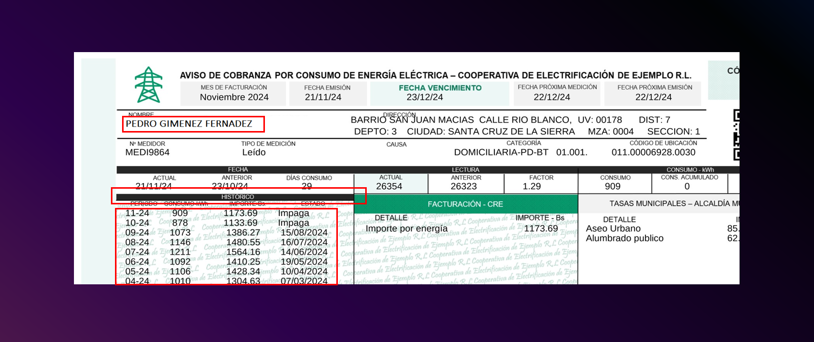
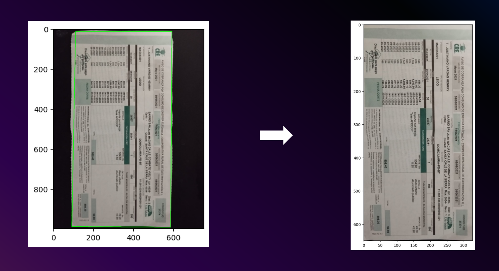

# Proof of Address Fraud Detection (Utility Bills)
This proyect aimed to build a utility bill fraud detection application using a computer vision approach, in the context of proof-of-address verification as part of an anti-money laudering (AML) compliance process.

## Introduction
A proof of address is one of the 4 pillars of Know Your Client (KYC). It confirms a person's registered home address, aiding in verifying the customer's identitity during a onboarding process in a financial institution or fintech. This step is required when opening a bank account or gaining access to specific financial services.

Proof-of-address documents submitted must be valid, for example: bank account statements, utility bills, property purchase deed, lease aggreement, government issued documents, etc.

Online verification of proof-of-address must take into account the possibility of receiving manipulated or adulterated documents and idenitfy any 

This project focused on fraud detection on utility bills.

## Dataset

The dataset was generated using a hybrid approach. The script [input/generator/generate.py](input/generator/generate.py) was used to generate real and fake documents. Some of the documents where futher manipulated using some approaches like copy-pasting of letters, designing out-of-date logos, replacing text on certain fields, etc.

After the generation, 400 documents where printed, cutted and photographed on different backgrounds, lighting conditions, angles and resolutions.

## Preprocessing
Photographed images where futher preprocessed by croping the documents after identifying the contours. The transformation functions are found in [code/utils/image_transform.py](code/utils/image_transform.py).



## Training
Keras was the framework used to build a deep neural network composed of 3 convolution layers, following by a hidden layer and a output layer.

The code for training can be found in [notebooks/train.ipynb](notebooks/train.ipynb)

The accuracy of the model on test data where ~93%.

## Serving
The script [serve.py](serve.py) can be used to start a uvicorn server, which will start a app serving at port 8080. An image from a local filesystem can be sent to the app for inference as form-data, using the key "file", to the endpoint "invocations".

```bash
curl --location 'http://localhost:8080/invocations' \
--form 'file=@"/path/to/file"'
```

It's recomended to create a virtual Python environment and installing the libraries in [requirements.txt](requirements.txt)